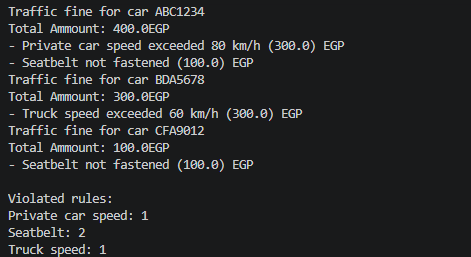
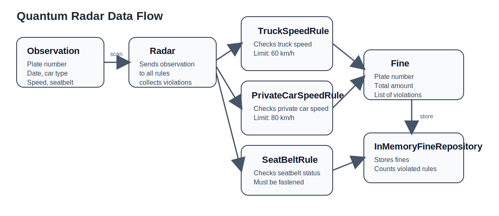

# Quantum Radar

Java project for the Fawry internship assessment.

## What It Does

The program simulates a radar system that scans vehicle observations and creates fines when a rule is violated.

Each observation contains:
- plate number
- date
- car type
- speed
- seatbelt status

The current rules are:
- private car speed must not exceed 80 km/h
- truck speed must not exceed 60 km/h
- seatbelt must be fastened

An observation can violate more than one rule.

## Project Parts

- `model` keeps the data classes like `Observation`, `Violation`, and `Fine`
- `rules` contains the traffic rules
- `service` contains `Radar`, which checks observations against the rules
- `repository` stores the created fines in memory

## Design

The rules follow a simple Strategy style.
New rules can be added by creating a new class that implements `TrafficRule`, Allowing easy add in the future.

## How To Run

From the project root:

```powershell
.\run.ps1
```

## Output Example

This is the terminal output after running the project:



## Data Flow Diagram

The flow below shows how an observation goes through the radar, rules, fine creation, and repository storage:



